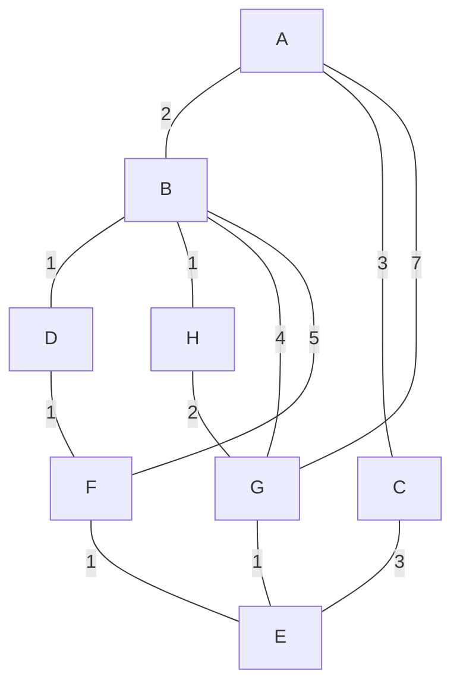

# Seite 220 Nr. 1

## a)

|Anzahl   anhängender   Knoten| 0.| 1.| 2.| 3.| 4.| 5.| 6.| 7.|
|:-:                                |---|---|---|---|---|---|---|---|
|A                                  | **0** | / | / | / | / | / | / | / |
|B                                  | ∞ | **2** | / | / | / | / | / | / |
|C                                  | ∞ | 3 | **3** | / | / | / | / | / |
|D                                  | ∞ | ∞ | 3 | **3** | / | / | / | / |
|E                                  | ∞ | ∞ | ∞ | 6 | 6 | 6 | **5** | / |
|F                                  | ∞ | ∞ | 7 | 7 | 4 | **4** | / | / |
|G                                  | ∞ | 7 | 6 | 6 | 6 | 6 | 5 | **5** |
|H                                  | ∞ | ∞ | 3 | 3 | **3** | / | / | / |

### Unvisited Nodes:

1. B, C, D, E, F, G, H
2. C, D, E, F, G, H
3. D, E, F, G, H
4. E, F, G, H
5. E, F, G
6. E, G
7. E
8. null

## b)

Der Weg ist 5 lang.